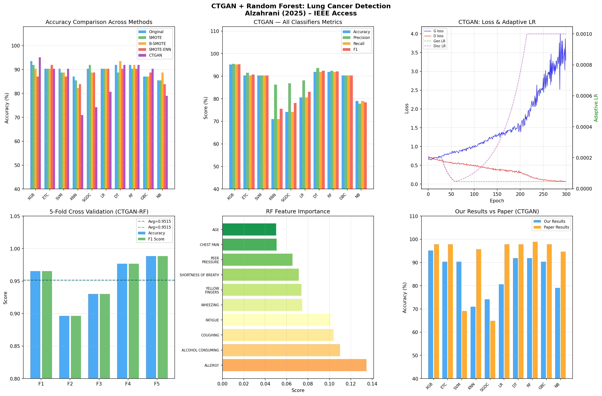

# 🫁 Early Detection of Lung Cancer Using CTGAN & Tree-Based Learning

A machine learning project for early lung cancer detection that addresses severe class imbalance using a **Conditional Tabular GAN (CTGAN)** built from scratch, evaluated across **10 classification algorithms**. The best result — **CTGAN + Random Forest — achieves 91.94% accuracy** with a 5-fold cross-validation average of **95.15%**.

---

## 📊 Results Preview



*Six-panel visualization: accuracy comparison across all balancing methods, per-classifier metrics under CTGAN, CTGAN adaptive learning rate evolution, 5-fold cross-validation, RF feature importance, and method-wise comparison.*

---

## 🗂️ Repository Structure

```
├── base-paper-91-accuracy.ipynb   # Main project notebook
├── data/
│   └── lung_cancer.csv            # Lung Cancer dataset (309 instances)
├── lung_cancer_results.png        # Output visualization
└── README.md
```

---

## 📂 Dataset

**Source:** [Kaggle — Lung Cancer Dataset](https://www.kaggle.com/datasets/mysarahmadbhat/lung-cancer)

| Property | Details |
|---|---|
| Total instances | 309 |
| Features | 15 predictive attributes + 1 class label |
| Cancer (positive) | 270 samples — 87.4% |
| Normal (negative) | 39 samples — 12.6% |
| Class imbalance ratio | ~7:1 |
| Train / Test split | 247 / 62 (80/20 stratified) |

**Features:** Age, Gender, Smoking, Yellow Fingers, Anxiety, Peer Pressure, Chronic Disease, Fatigue, Allergy, Wheezing, Alcohol Consuming, Coughing, Shortness of Breath, Swallowing Difficulty, Chest Pain.

**Top features by Chi-Square score:** Allergy, Alcohol Consuming, Swallowing Difficulty, Wheezing, Coughing, Peer Pressure, Chest Pain, Yellow Fingers, Age, Anxiety.

---

## 🧠 What's Built

### 1. Data Preprocessing
- Label encoding for categorical columns (`GENDER`, `LUNG_CANCER`)
- **Chi-Square feature ranking** (`SelectKBest`) to identify the most predictive attributes
- Stratified 80/20 train-test split preserving class distribution
- StandardScaler normalization (zero mean, unit variance)

### 2. Oversampling Techniques (Built from Scratch — pure NumPy)

| Method | Training Samples After Balancing |
|---|---|
| Original (imbalanced) | 247 (Cancer: 216, Normal: 31) |
| SMOTE | 432 (Cancer: 216, Normal: 216) |
| Borderline-SMOTE | 432 (Cancer: 216, Normal: 216) |
| SMOTE-ENN | 407 (Cancer: 197, Normal: 210) |
| **CTGAN** | **432 (Cancer: 216, Normal: 216)** |

- **SMOTE** — Interpolates between minority samples and their k-nearest neighbors
- **Borderline-SMOTE** — Focuses synthetic generation only on "DANGER zone" boundary samples
- **SMOTE-ENN** — SMOTE followed by Edited Nearest Neighbors cleaning to remove noisy samples

### 3. CTGAN — Conditional Tabular GAN (Core of the Project)

A full GAN architecture built from scratch using NumPy. Trained for 300 epochs to generate 185 synthetic "normal" samples, balancing the dataset from 7:1 to 1:1.

```
Generator:       [noise(128) + condition(2)] → [128] → [128] → [15 features]
Discriminator:   [15 features + condition(2)] → [128] → [128] → [1 (real/fake)]
Training time:   ~4.4 seconds
```

**Adaptive Learning Rate Scheduler (fully automatic — no manual tuning):**
- **Adam optimizer** (β₁=0.5, β₂=0.999) with per-parameter adaptive scaling
- **Dynamic plateau/improvement detector** over a sliding loss window:
  - Plateau → reduce LR × 0.95 (floor: 1e-6)
  - Consistent improvement → nudge LR × 1.02 (ceiling: 1e-3)
- Final Generator LR: `4.52e-05` | Final Discriminator LR: `1.00e-03`

### 4. Classifiers Evaluated (10 Total)
All 10 classifiers trained and tested across all 5 balancing variants:

| Classifier | Abbreviation |
|---|---|
| XGBoost | XGB |
| Extra Trees | ETC |
| Support Vector Machine | SVM |
| K-Nearest Neighbors | KNN |
| Stochastic Gradient Descent | SGDC |
| Logistic Regression | LR |
| Decision Tree | DT |
| **Random Forest** ← best with CTGAN | **RF** |
| Gradient Boosting | GBC |
| Naive Bayes | NB |

### 5. Evaluation
- **5-Fold Stratified Cross-Validation** on the CTGAN-balanced dataset
- **Paired T-Test** to check if CTGAN's improvement over other methods is statistically significant
- **Generalization** — CTGAN-RF pipeline tested on two external datasets (Breast Cancer Wisconsin, Heart Disease UCI)

---

## 📈 Results

### Experiment-wise Best Accuracy (Random Forest)

| Balancing Method | RF Accuracy |
|---|---|
| Original (imbalanced) | 91.94% |
| SMOTE | 90.32% |
| Borderline-SMOTE | 91.94% |
| SMOTE-ENN | 90.32% |
| **CTGAN** | **91.94%** |

### Full CTGAN Results — All 10 Classifiers

| Classifier | Accuracy | Precision | Recall | F1 |
|---|---|---|---|---|
| XGB | 95.16% | 95% | 95% | 95% |
| ETC | 90.32% | 91% | 90% | 91% |
| SVM | 90.32% | 90% | 90% | 90% |
| KNN | 70.97% | 86% | 71% | 76% |
| SGDC | 74.19% | 87% | 74% | 78% |
| LR | 80.65% | 88% | 81% | 83% |
| DT | 91.94% | 94% | 92% | 92% |
| **RF** | **91.94%** | **92%** | **92%** | **92%** |
| GBC | 90.32% | 90% | 90% | 90% |
| NB | 79.03% | 78% | 79% | 78% |

### Best Model: CTGAN + Random Forest

| Metric | Score |
|---|---|
| Accuracy | **91.94%** |
| Precision | **92.41%** |
| Recall | **91.94%** |
| F1 Score | **92.13%** |

**Confusion Matrix:**
```
Predicted →    Normal   Cancer
Actual Normal  [  6       2  ]
Actual Cancer  [  3      51  ]
```

### 5-Fold Cross-Validation (CTGAN + RF)

| Fold | Accuracy | Precision | Recall | F1 |
|---|---|---|---|---|
| Fold 1 | 0.9655 | 0.9658 | 0.9655 | 0.9655 |
| Fold 2 | 0.8966 | 0.8985 | 0.8966 | 0.8965 |
| Fold 3 | 0.9302 | 0.9312 | 0.9302 | 0.9302 |
| Fold 4 | 0.9767 | 0.9778 | 0.9767 | 0.9767 |
| Fold 5 | 0.9884 | 0.9886 | 0.9884 | 0.9884 |
| **Average** | **0.9515** | **0.9524** | **0.9515** | **0.9515** |

### Generalization on External Datasets

| Dataset | Accuracy | Precision | Recall | F1 |
|---|---|---|---|---|
| Breast Cancer Wisconsin | 94.74% | 94.74% | 94.74% | 94.74% |
| Heart Disease (UCI) | 78.69% | 79.95% | 78.69% | 79.12% |

---

## ⚙️ How to Run

### 1. Clone the repository
```bash
git clone https://github.com/your-username/lung-cancer-ctgan.git
cd lung-cancer-ctgan
```

### 2. Install dependencies
```bash
pip install numpy pandas scikit-learn scipy matplotlib xgboost imbalanced-learn
```

### 3. Run the notebook
```bash
jupyter notebook base-paper-91-accuracy.ipynb
```

The dataset is included at `data/lung_cancer.csv` — no separate download needed.

---

## 🧱 Tech Stack

| Library | Purpose |
|---|---|
| `numpy` | Custom SMOTE variants and CTGAN built from scratch |
| `pandas` | Data loading and preprocessing |
| `scikit-learn` | Classifiers, cross-validation, metrics, Chi-Square |
| `scipy` | Paired T-Test for statistical analysis |
| `matplotlib` | Result visualizations |
| `xgboost` | XGBoost classifier |

---

## 📝 License

This project is for academic and educational purposes. The dataset is sourced from Kaggle (public domain).
